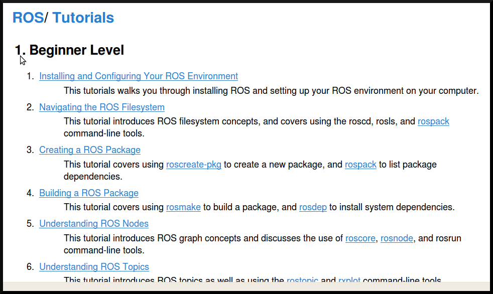
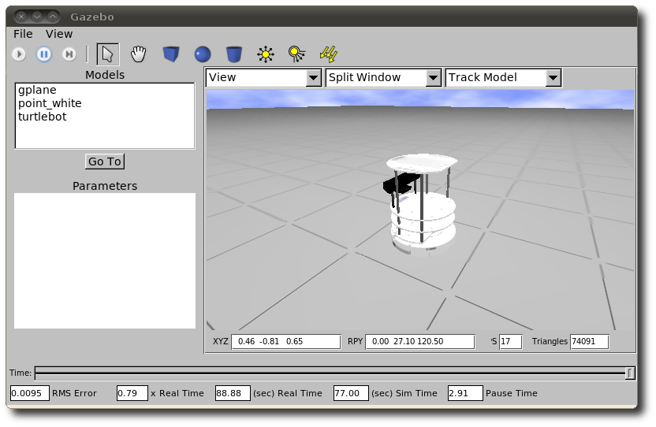

.. page-load-style:: styles/title

ROS: 

.. page-style:: 
   :font_size: 40

The Robot Operating System

.. page-style::
   :font_size: 20

Tully Foote

.. image:: images/wg_logo.jpg
   :width: 200

.. note::
   Connect:  Who's use robots before? 
   Who's been entirely satisfied with what the robot did? 
   Who's developed for a robot?

Presentation Outline
--------------------
.. load-style:: styles/main

.. page-style:: 
   :font_size: 40

.. image:: images/pie_in_sky.jpg
   :height: 200

.. image:: images/wg_logo.jpg
   :height: 200

.. image:: images/future.jpg
   :height: 200

.. note:: 
   Outline of my talk, I'll start with the vision for open source personal robots, The current implementation. And where we're going.  

.. include:: motivation.rst

----

.. include:: state_of_ros.rst

----

.. include:: PR2.rst

----

.. layout::
   :vgradient:white;white

.. image:: images/future.jpg

.. note::
   Transition to where we want to go.  Keep expanding user base.  Make it easier to use ROS as a development platform. 

ROS Fuerte RC1
--------------

.. load-style:: styles/future

----

.. page-style:: 
   :list.expose: expose
   :align: center
   :list.bullet: none

- .. image:: images/osrf-horiz.png
     :width: 1024

- .. image:: images/roboticschallenge.jpg
     :width: 512

.. note::
   Just yesterday we announced the Open Source Robotics Foundation
   Designated to be a facilitator of OSR
   First project will be DARPA Simulator

Future Plans
------------

.. image:: images/ubuntu.png
   :width: 600

.. image:: images/fedora.png
   :width: 600

.. image:: images/android.jpg
   :width: 600

.. note:: 

   We're growing the community and now we're planning to start pushing
   our more mature code upstream to ubuntu and fedora repos.  Toward
   growing the community we are also now reaching out to more people
   by pushing our software onto smaller platforms.  We have many
   people starting to use ROS on Android and Arm based computer.  We
   just launched the TurtleBot running on Atom based laptops.

----

.. load-style:: styles/main

Try it out!

Tutorials
---------

.. page-style:: 
   :font_size: 40
   :bold: yes

http://ros.org/wiki/ROS/Tutorials

The TurtleBot
-------------

.. image:: images/turtlebot.jpg
   :height: 650

.. note:: Introduce Turtlebot, getting from research into the home
   Small platform, give people access to the ROS community in a
   package they can take home.

.. note::
   Don't spend too long, talk more after video.  

----

.. video:: videos/turtlebot.mp4

----

.. note:: ADD NOTES FOR SMARTPHONE analigy, give people the capability to implement their passion

================================ ========================== ===============================
.. image:: images/droid.jpg      .. image:: images/l--r.jpg      .. image:: images/turtlebot.jpg
                                                                    :height: 325
================================ ========================== ===============================

.. note:: 
   Computer are great, they can display things, but what would you want them to do if they could move?   

   Who thinks they have the hardware to user robot code?
   Who has a computer and a webcam?  Who has a Kinect?  
   Simulator?  
   Rovio, roomba.  

Simulator
---------

----

Thank You

Questions?

.. style::
   :font_size: 20

Check it out: www.ros.org

Email: tfoote@willowgarage.com

Image Sources
-------------

.. style::
   :font_size: 20

- Roomba Public Domain on Wikipedia
- Paro http://www.parorobots.com/pdf/pressreleases/PARO to be marketed 2004-9.pdf
- Pleo http://en.wikipedia.org/wiki/File:Pleo_robot.jpg
- Debian Package Management http://murugaprabu.me/wordpress/2011/01/16/hello-world/
- Urban Challenge kwc.org
- Success Chart https://cs.byu.edu/image/302-success_clipart
- Jenkins Logo https://wiki.jenkins-ci.org/display/JENKINS/Logo
- Droid Photo http://www.motorola.com/staticfiles/Consumers/Products/Mobile%20Phones/DROID-3-By-Motorola/_Images/Droid-X3_Production_Specs.jpg
- Android Logo http://farm4.staticflickr.com/3034/3754407004_33e592d075.jpg

