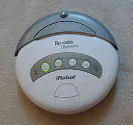
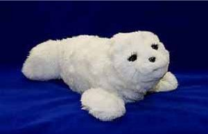

.. page-load-style:: big-centered

.. layout::
   :vgradient:white;gray

Linux Based Personal Robots

Tully Foote
Willow Garage

----

.. page-load-style:: big-centered

What is a personal robot?

.. note::
   Seek audiance input/suggestions. 

   From movies and TV: R2D2, iRobot

   In the real world.  iRobot Create, 

   End with Rosie

Sci Fi Personal Robots
----------------------

.. page-load-style:: big-centered
        

=================================== ==============================
.. image:: images/rosie_singing.gif .. image:: images/r2d2_200.jpg
=================================== ==============================

.. note:: We'd all love to have these robots
   But what robots do we have in the home. 

Personal Robots In Homes
------------------------

.. note:: We have simple cleaning robots.  They sometimes can work on
   their own, sometimes they're more entertainment.  

.. note:: And we have many robots companions, but the extent of their 
   abilities is to make noises and wiggle a little.

My Background
-------------
.. page-style:: 
   :list.expose: expose
   :align: center
   :list.bullet: none

- .. image:: images/bob.jpg
     :height: 220

- .. image:: images/alice.jpg
     :height: 220

- .. image:: images/little_ben_220.jpg
     :height: 220

.. The TurtleBot

-------------

.. page-load-style:: big-centered

.. image:: images/turtlebot.jpg

Live Demo!

.. note:: Introduce Turtlebot, getting from research into the home
   Small platform, give people access to the ROS community in a
   package they can take home.

.. note::  

----

.. page-load-style:: big-centered

Thank You

Questions?

