.. load-style:: gradient

.. layout::
   :vgradient:white;white

Linux Based Personal Robots

.. page-style::
   :font_size: 20

Tully Foote

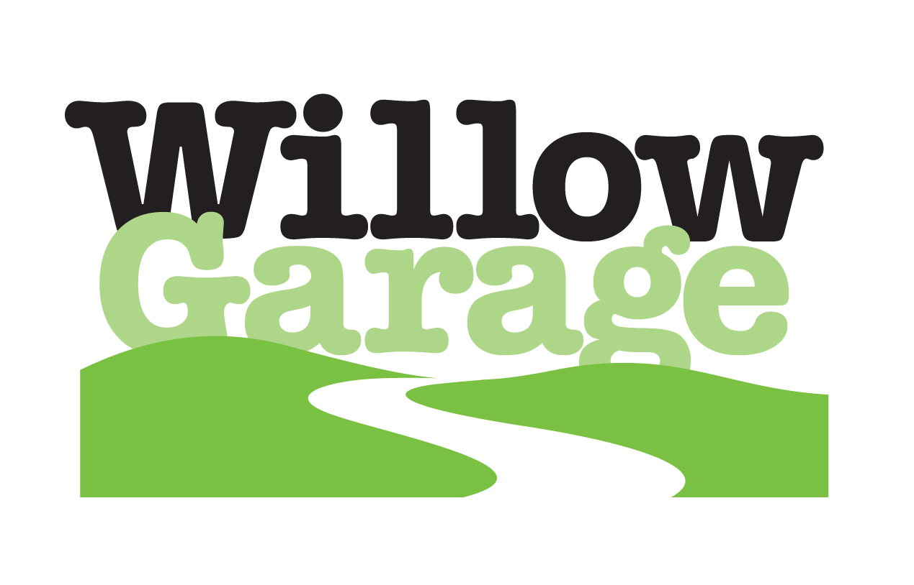

.. note::
   Connect who's use robots before? 
   Who's been entirely satisfied with what the robot did? 
   Who's developed for a robot?

----

What is a personal robot?

.. note::
   Seek audiance input/suggestions. 

   From movies and TV: R2D2, iRobot

   In the real world.  iRobot Create, 

   End with Rosie

Sci Fi Personal Robots
----------------------

=================================== ==============================
.. image:: images/rosie_singing.gif .. image:: images/r2d2_200.jpg
=================================== ==============================

.. note:: We'd all love to have these robots
   But what robots do we have in the home. 

Personal Robots In Homes
------------------------
.. page-style:: 
   :list.expose: expose
   :align: center
   :list.bullet: none

- .. image:: images/roomba_220.jpg
    :height: 200

.. note:: We have simple cleaning robots.  They sometimes can work on
   their own, sometimes they're more entertainment.  

- .. image:: images/paro.jpg
    :height: 200

.. note:: And we have many robots companions, but the extent of their 
   abilities is to make noises and wiggle a little.

- .. image:: images/800px-Pleo_robot.jpg
     :height: 200

.. note:: And we have many robots companions, but the extent of their 
   abilities is to make noises and wiggle a little.

Presentation Outline
--------------------

.. page-style:: 
   :font_size: 40

.. note:: 
   Outline of my talk, I'll start with the vision for open source personal robots, The current implementation. And where we're going.  

Motivation
----------

.. note::

   To give you a sense of motivation I'm going to give you a bit of my background.  

My Background
-------------

.. layout::
   :image: images/pie_in_sky_small.jpg;halign=right;valign=top
   :vgradient:white;white

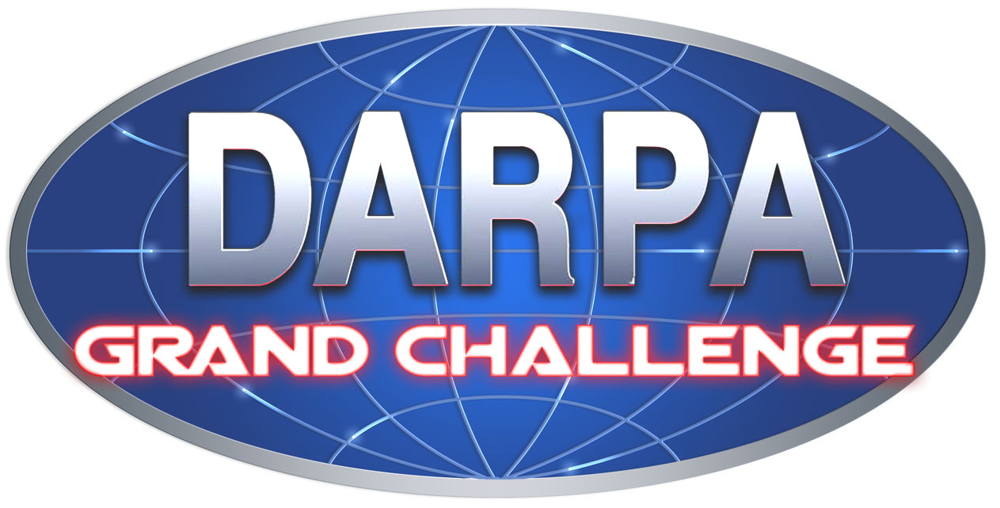

.. note:: 

   Connect with audience!!! Ask how many know of Grand Challenge? HOw many particpiated? 
   What is the grand challenge?

.. note::

   Explain Grand Challenge: Tony Tether's vision.  Cost of contracting
   with defence firms, lack of promise.
   - Leverage prize money.  -- Administration was much more than the prize money.  

My Background
-------------

.. page-style:: 
   :list.expose: expose
   :align: center
   :list.bullet: none

- .. image:: images/bob.jpg
     :height: 220

- .. image:: images/alice.jpg
     :height: 220
     
- .. image:: images/little_ben.jpg
     :height: 220

.. note::
   Dell Gentoo/Slackware RTAI Servers with Fedora desktop
   IBM Servers with Slackware installation
   Mac Mini's with Ubuntu and Matlab

.. note::

   Possible story about Distance that Bob Traveled, barbed wire issue.  

   Possible story about Alice failure, combined laser failures, with GPS outage, and stopping to reset while under power lines and a bug in the resume code. 

   Possible story about Little Ben mac minis and sensors being removed due to parking in West Philly, compare to East Palo Alto, Compton

---------------------

.. note:: DARPA Urban Grand Challenge

.. Little Ben + Junior
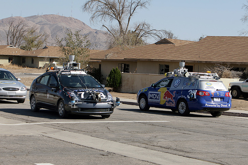

.. note::
   Why did DARPA choose the challenge format? -- because paying military contractors to do this is much less efficient than crowd sourcing.  

.. note:: Note the similarities between these two cars.  The code
   which defined the difference between the winning car and the other
   finalists was maybe 10 percent of the effort.  The other 90% of the
   efforts could have been shared and not given up their competitive
   advantage.  And think if the 100+ teams in the overall competition
   had all contributed just a little bit to a shared pool.  
   Of course I'm preaching to the choir.

.. note:: This is indicative of the state of academic robotics in general.  
   TRANSITION TO PHD COMIC

----

.. PHD COMIC
.. image:: images/phd_comic.jpg

.. TODO change to progressive reveal of one word + image simplified

----

.. page-style::
   :align: center
   :layout.valign: center
   :font_size: 40

============================== ==========================
 .. image:: images/recycle.png .. page-style::
                                  :layout.valign: center
                                  :font_size: 60

                               - Reduce 
                               - Reuse
                               - Recycle
============================== ==========================

.. TODO fixme get this table working well 

.. note:: You can take the 3 tenants of recycling and directly apply them here. 
   The goal is to reduce wasted effort and make people more productive.  
   Reduce the amount of code written. 
   Reuse existing code, don't reimplement it if someone's already done it
   Recycle -- take parts of existing code and reuse them

.. note:: Values -- less volume + more eyes -> higher code quality, no duplicated effort.

.. note:: TRANSITION: The way to do this effectively is to collaborate better.  

----

.. Tux + Research

.. style::
   :align: center
   :layout.valign: center

========================= ========================== ==================================
.. image:: images/tux.png .. image:: images/plus.png .. image:: images/books_open.jpg
                             :height: 314               :height: 314
========================= ========================== ==================================

.. note:: 
   
   Computer industry is booming, and alot of it is due to the
   availability of open source software in particular linux.  We're
   looking to kick start the robotics industry in the same way.

----

.. layout::
   :vgradient:white;white

.. note::
   What is the solution?
   WG MIssion Open source lead to ROS

.. note:: Transition into how we're doing it with ROS

----

.. layout::
   :image: images/wg_logo_small.jpg;halign=right;valign=top
   :vgradient:white;white

----

=============================== ===================================
.. image:: images/direction.jpg .. image:: images/osi_symbol.jpg
=============================== ===================================
.. image:: images/balance.jpg   .. image:: images/documentation.jpg
=============================== ===================================

.. note:: 
  A goal and direction -- to get others to follow
  Open source platform
  Good software engineering practices
  Stable APIs
  Good documentation!!  This is one of the primary reasons ROS is adopted world wide, while many other previous attempts never get traction.  

Tools for Developers
--------------------

..  note:: Transition to summary of some of the existing tools in ROS.

Tools for Developers
--------------------

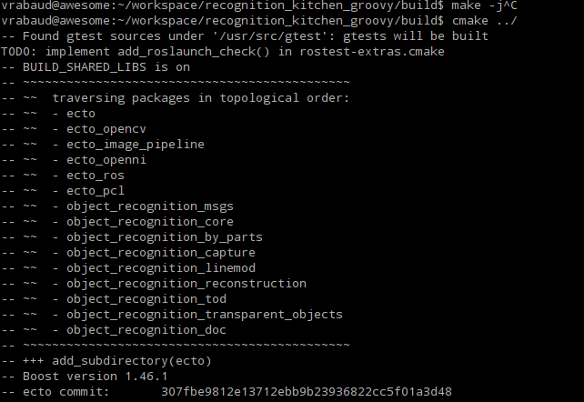

.. note::

   Our focus on making development in user space easier, to allow computer/robot sharing is important.  No installation of unreleased code onto the system.  

Tools for Developers
--------------------

.. video:: videos/rviz_30_second.mpeg

.. note::

   One of the first reasons some people adopt ROS is due to the easy visualization tools.  If there's data in the system, most of it can be visualized w/o custom code.  
   Transition to rxplot.

Tools for the Community
-----------------------

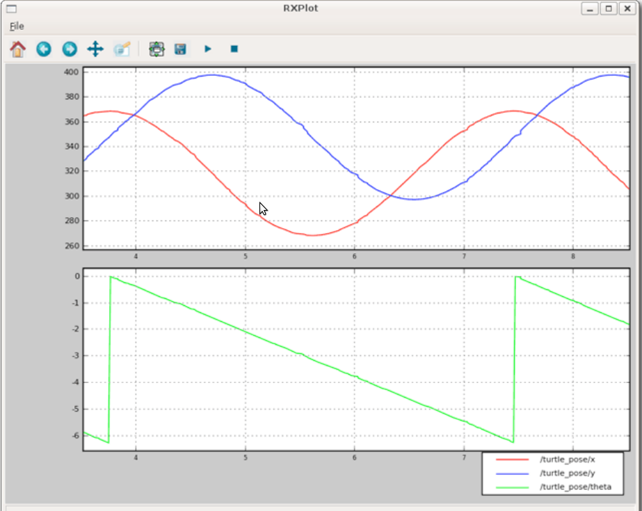

.. note::

   rviz in 3d, rxplot numerical values

Tools for the Community
-----------------------

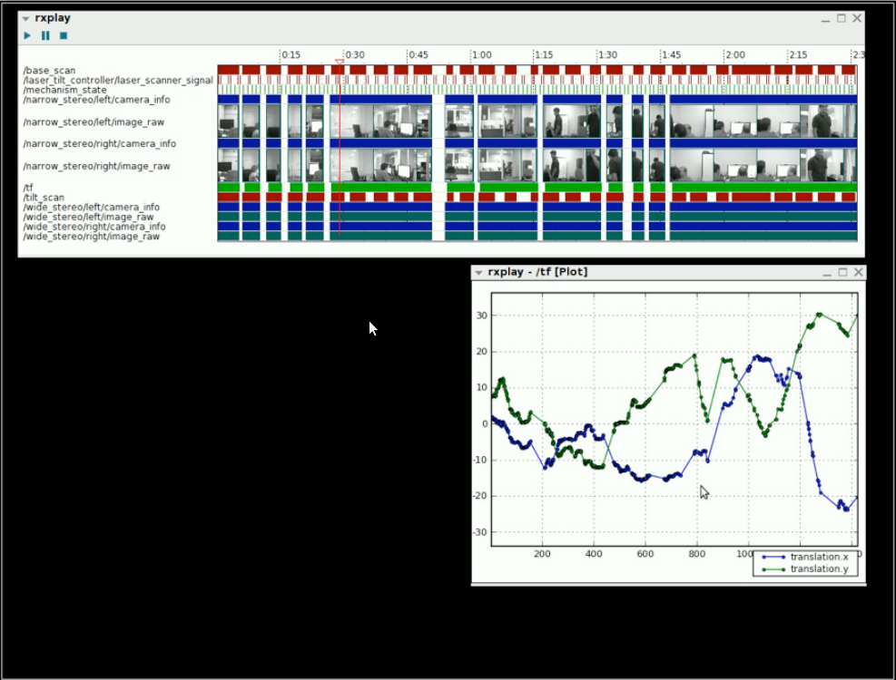

.. note::

   Logging and playback utilities are critical for both debugging and generating datasets for research. 

Tools for the Community
-----------------------

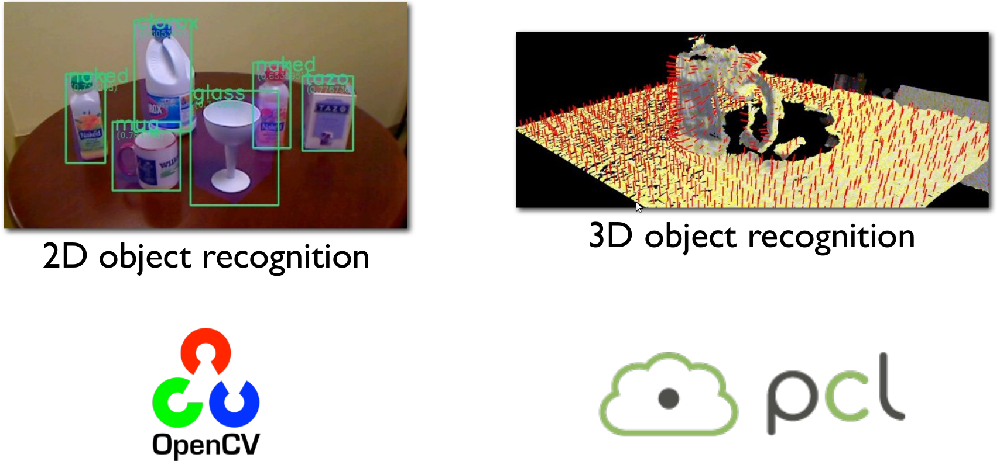

.. note::

   Integration with existing state of the art perception libraries.  
   Mention Orocos too.  Not reinvent the wheel, integrate existing technology.  

Tools for the Community
-----------------------

.. image:: images/jenkins.png
   :width: 600

.. TODO ADD IMAGE of dashboard

.. note::

   We've seen significant improvements in our code quality and
   usability.  And extending this to the entire community helps
   everyone.

.. note::

   We have implemented continuous integration and release testing for
   all stacks publicly release in the ROS community.  And the
   infrastructure is also being used externally to index and test
   private repositories.

.. MORE DETAILS 5 minute quick builds on commit, overnight builds to test full releases, release tarball generation

Tools for the Community
-----------------------

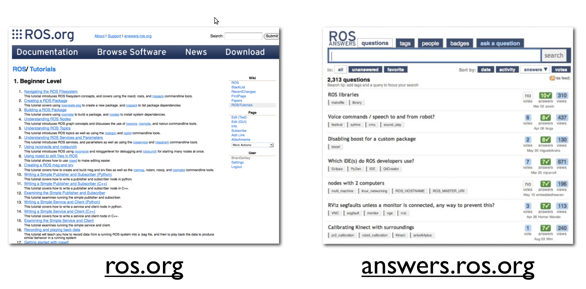

Worldwide community
-------------------

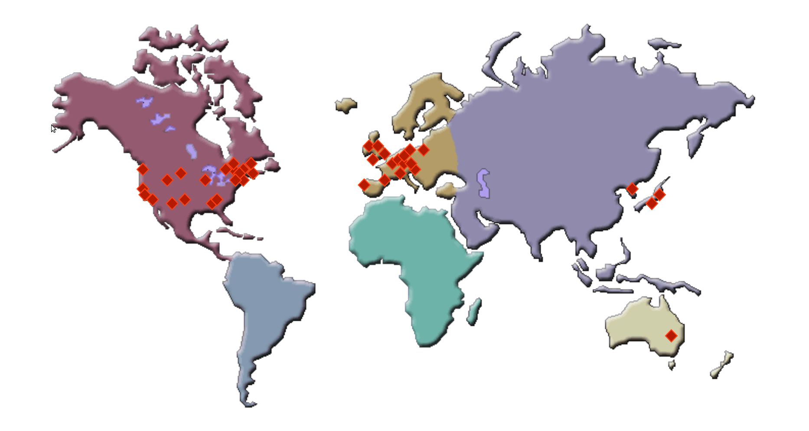

.. note:: 

   This represents the locations of most of the public repositories
   which are releaseing open source code and we are indexing.

.. note::

   To be able to write state of the art software we needed a state of
   the art robot.  I give you the PR2.

Worldwide community
-------------------

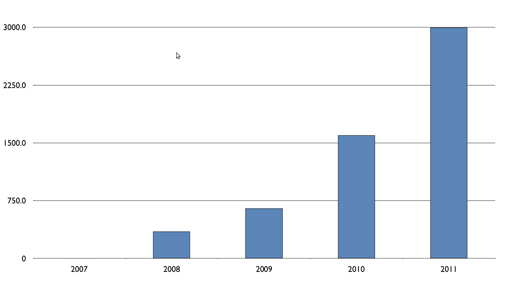

.. note::

   Fast growth around the world.  This is similar to our use base.  First a few of us in Willow.  Then a few grad students.  Then a few labs.  Then a few schools.  Now many schools and labs around the world.   

Worldwide community
-------------------

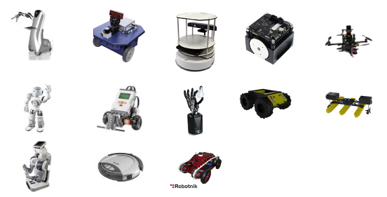

.. note::

   These are all robots which have ROS drivers release and ROS is the recommended way to interact with them.  

----

How do you prove your software works?

.. note::

   We have this vision for ROS but to get others to buy in that it's actually good we need to have great demos.  To have great demos we need a great robot.  

PR2
---

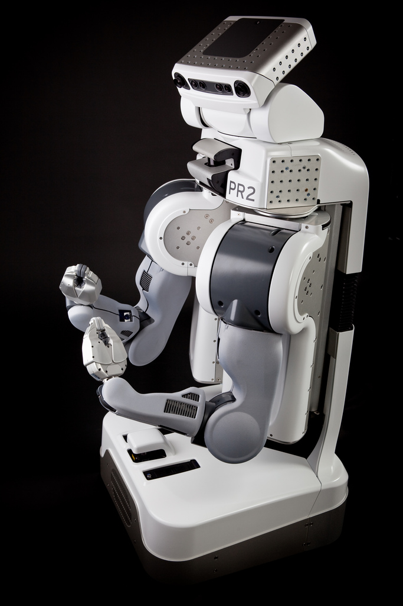

.. note::
   
   2 dual quad core Intel i7 servers with 32 Gb ram each pulling 500Watts each (motors are only 200W at full power)
   2 wifi routers + gigabit ethernet port with automatic network rerouting
   5 ethernet cameras
   2 laser range finders
   32 motorized joints
   16 Lithium-Ion laptop batteries

.. note::

   Design goal was to be robot software developers dream platform.  Emphasis
   on uptime, reliability and robustness.  Also easy user switching
   for time sharing.  Usually research robots run a few days a month,
   PR2s sometimes do 3 shifts of students.

   Talk about safe arms, with spring counter balance.  I"m willing to
   work right in front of the robot w/o looking due to only 4 poinds
   force.  I know of other common robot arms which have punched
   through the middle of the table in front of them the first time
   they were turned on.

PR2
---

What's a good challenge for the PR2?

.. note::
   Ask the audience their suggestions

PR2
---

How about a marathon?

PR2
---

.. note:: 
   Video silent, talk over it.  

.. video:: videos/milestone2_and_replugged.mpeg

.. note:: 

   Our first milestone was 3.14 km autonomous.  

   Our 2nd milestone was 26 miles autonomous
   Needed to teach it to plug in and open doors.  
   Some hacks needed to pull this off on our timeline.  

   Revisited plugs with production hardware and you can see it now plugging in cleanly.  

   Option: We got coverage in a running magazine for this.  

PR2
--- 

Can we make it play pool?

In one week?

.. note:: 
   Now that we've got a platform what can we do in a week to test our development?
   We gave ourselves this challenge as a hackathon.  Starting monday, demo on friday of what we can do.  

PR2
--- 

.. video:: videos/pool_reduced.mpeg

.. note::

   We had some more free time and wanted to get the PR2 doing something cool, in a week to identify weaknesses in the platform.  So we spent a week teaching it to play pool.  

PR2
--- 

How about fetch beer?

.. note::
   
   With the success of the pool playing robot, we though we might do it again for fetching beer from the fridge.  

.. note:: 
   Another 1 week long hackathon.  

   Let this one speak for itself. 

PR2
---

.. video:: videos/beer_short.mpeg

PR2
---

What can others do with the PR2?

.. note:: 
   We've shown that we who built the robot can use it, but what about external users?  

PR2
---

.. note::
   
   Background for video.  UCBerkeley student visited us and got the prototype PR2 folding towels at 25 min/ towel.  A year later UC Berkeley was able to demonstrate it in 5 minutes.  

.. video:: videos/towel_speedup.mpeg

----

.. layout::
   :vgradient:white;white

.. note::
   Transition to where we want to go.  Keep expanding user base.  Make it easier to use ROS as a development platform. 

Future Plans
------------

.. layout::
   :image: images/future_small.jpg;halign=right;valign=top
   :vgradient:white;white

.. image:: images/fedora.png
   :width: 600

.. note:: 

   We're growing the community and now we're planning to start pushing
   our more mature code upstream to ubuntu and fedora repos.  Toward
   growing the community we are also now reaching out to more people
   by pushing our software onto smaller platforms.  We have many
   people starting to use ROS on Android and Arm based computer.  We
   just launched the TurtleBot running on Atom based laptops.

The TurtleBot
-------------

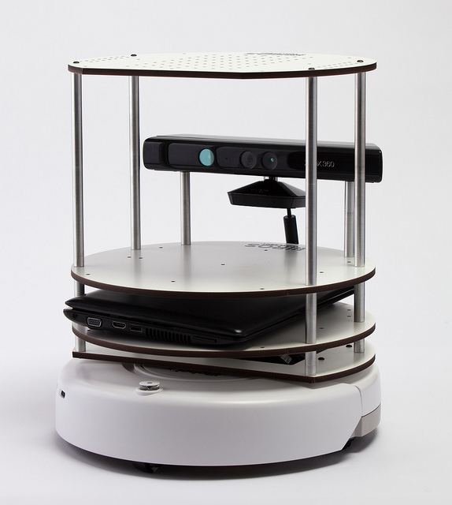

.. note:: Introduce Turtlebot, getting from research into the home
   Small platform, give people access to the ROS community in a
   package they can take home.

.. note::
   Don't spend too long, talk more after video.  

----

.. video:: videos/turtlebot.mp4
   :width: 800

----

.. note:: ADD NOTES FOR SMARTPHONE analigy, give people the capability to implement their passion

================================ ========================== ===============================
.. image:: images/droid.jpg      .. image:: images/l--r.jpg      .. image:: images/turtlebot.jpg
                                                                    :height: 325
================================ ========================== ===============================

.. note:: Computer are great, they can display things, but what would you want them to do if they could move?   

----

Thank You

Questions?

.. style::
   :font_size: 20

For more information visit: www.ros.org

Email: tfoote@willowgarage.com

Image Sources
-------------

.. style::
   :font_size: 20

- Roomba Public Domain on Wikipedia
- Paro http://www.parorobots.com/pdf/pressreleases/PARO to be marketed 2004-9.pdf
- Pleo http://en.wikipedia.org/wiki/File:Pleo_robot.jpg
- Debian Package Management http://murugaprabu.me/wordpress/2011/01/16/hello-world/
- Urban Challenge kwc.org
- Success Chart https://cs.byu.edu/image/302-success_clipart
- Jenkins Logo https://wiki.jenkins-ci.org/display/JENKINS/Logo
- Droid Photo http://www.motorola.com/staticfiles/Consumers/Products/Mobile%20Phones/DROID-3-By-Motorola/_Images/Droid-X3_Production_Specs.jpg
- Android Logo http://farm4.staticflickr.com/3034/3754407004_33e592d075.jpg

