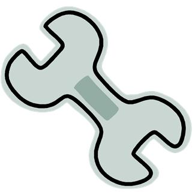
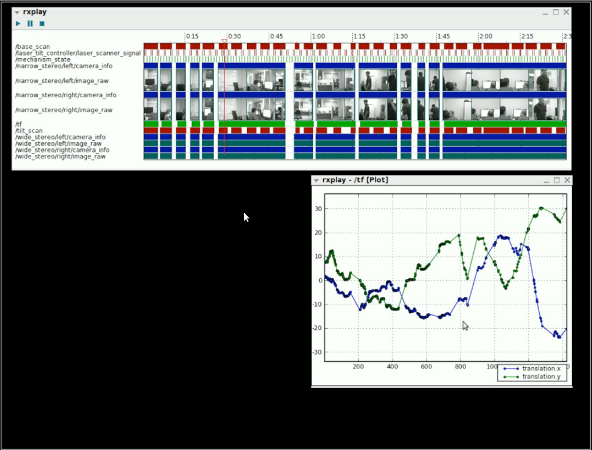
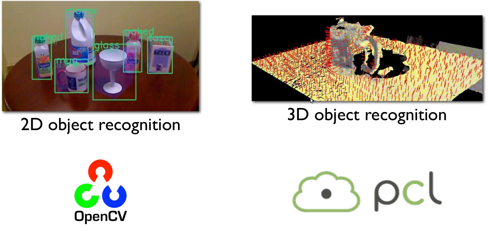
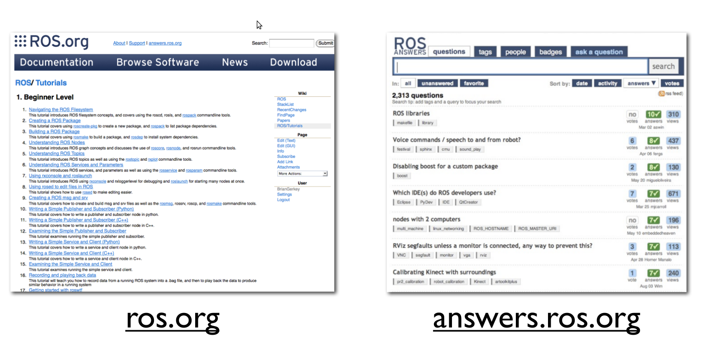
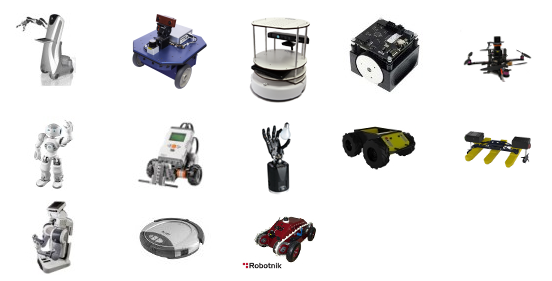

.. page-load-style:: styles/main

.. image:: images/wg_logo.jpg
   :width: 500

.. note::
   What is the solution?
   WG MIssion Open source lead to ROS

.. note:: Transition into how we're doing it with ROS

----

.. load-style:: styles/current

.. image:: images/ros.png
   :width: 700

----

=============================== ===================================
.. image:: images/direction.jpg .. image:: images/osi_symbol.jpg
=============================== ===================================
.. image:: images/balance.jpg   .. image:: images/documentation.jpg
=============================== ===================================

.. note:: 
  A goal and direction -- to get others to follow
  Open source platform
  Good software engineering practices
  Stable APIs
  Good documentation!!  This is one of the primary reasons ROS is adopted world wide, while many other previous attempts never get traction.  

Tools for Developers
--------------------

..  note:: Transition to summary of some of the existing tools in ROS.

Tools for Developers
--------------------

.. image:: images/rosmake.png
   :width: 800

.. note::

   Our focus on making development in user space easier, to allow computer/robot sharing is important.  No installation of unreleased code onto the system.  

Tools for Developers
--------------------

.. video:: videos/rviz_30_second.mpeg

.. note::

   One of the first reasons some people adopt ROS is due to the easy visualization tools.  If there's data in the system, most of it can be visualized w/o custom code.  
   Transition to rxplot.

Tools for the Community
-----------------------

.. image:: images/plotting.png
   :width: 800

.. note::

   rviz in 3d, rxplot numerical values

Tools for the Community
-----------------------

.. note::

   Logging and playback utilities are critical for both debugging and generating datasets for research. 

Tools for the Community
-----------------------

.. note::

   Integration with existing state of the art perception libraries.  
   Mention Orocos too.  Not reinvent the wheel, integrate existing technology.  

Tools for the Community
-----------------------

.. image:: images/jenkins.png
   :width: 600

.. image:: images/success.gif
   :width: 400

.. TODO ADD IMAGE of dashboard

.. note::

   We've seen significant improvements in our code quality and
   usability.  And extending this to the entire community helps
   everyone.

.. note::

   We have implemented continuous integration and release testing for
   all stacks publicly release in the ROS community.  And the
   infrastructure is also being used externally to index and test
   private repositories.

.. MORE DETAILS 5 minute quick builds on commit, overnight builds to test full releases, release tarball generation

Tools for the Community
-----------------------

Worldwide community
-------------------

.. note:: 

   This represents the locations of most of the public repositories
   which are releaseing open source code and we are indexing.

.. note::

   To be able to write state of the art software we needed a state of
   the art robot.  I give you the PR2.

Worldwide community
-------------------

.. note::

   Fast growth around the world.  This is similar to our user base.  First a few of us in Willow.  Then a few grad students.  Then a few labs.  Then a few schools.  Now many schools and labs around the world.   

Worldwide community
-------------------

.. note::

   These are all robots which have ROS drivers release and ROS is the recommended way to interact with them.  
